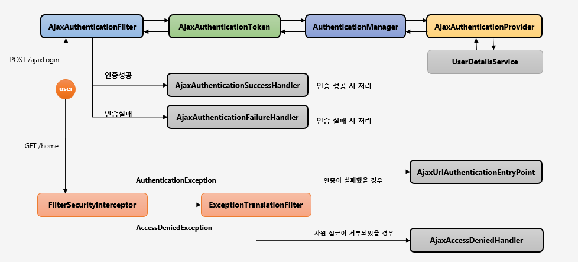

# Duckty
### [요청 프로세스]

- Request
- -> JwtFilter : header의 Access Token 값으로 Token 유효성확인 후 Authentication 설정
- -> (로그인 LoginProcessingFilter)
- -> AuthorizationFilter.java authorizationManager.check : 인증/인가 확인
	-  ExceptionTranslationFilter.java 에서 AccessDeniedException 처리
	- ->인증X AuthenticationEntryPoint
	- -> 인증O, 인가X AccessDeniedHandler

### [로그인 프로세스]
- AjaxLoginConfigurer : 로그인 설정
- loginProcessingUrl : /api/users/login 
- AjaxLoginProcessingFilter extends AbstractAuthenticationProcessingFilter
	- http.addFilterBefore(getAuthenticationFilter(), UsernamePasswordAuthenticationFilter.class);

- /api/users/login 요청
- -> AjaxLoginProcessingFilter(attemptAuthentication) : 요청을 통해 들어온 id,pw를 AjaxAuthenticationToken에 저장 후 전달
- -> AjaxAuthenticationProvider : 로그인 처리 - 회원조회, 비밀번호 확인, 잠금, 비밀번호 만료, ISMS(추가예정)
	- 성공 AuthenticationSuccessHandler : JWT 생성 후 response
	- 실패 예외 발생 AuthenticationFailureHandler : 에러메세지와 함께 실패 response

- MainSecurityConfig
	- /api/** 에 대한 시큐리티 설정
	- ROLE_USER 권한이 있어야 함(ROLE_MANAGER)
	- 