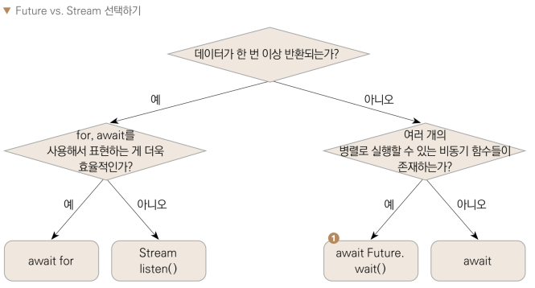

## 비동기
```Dart
void main() async {
  final result = await addNumbers(1, 1);
  print('결과값 = $result');
  
  final result2 = await addNumbers(2, 2);
  print('결과값 = $result2');
}

Future<int> addNumbers(int number1, int number2) async {
  print('$number1 + $number2 계산 시작!');

  await Future.delayed(Duration(seconds: 3), () {
    print('$number1 + $number2 = ${number1 + number2}');
  });
  
  print('$number1 + $number2 코드 실행 끝');
  
  return number1 + number2;
}
```




- async 키워드를 사용하면 비동기 함수를 정의할 수 있다.
- await 키워드를 사용하면 비동기 함수를 논리적 순서대로 실행할 수 있다.
- Future는 한 번만 비동기 응답을 받을 때 사용하는 클래스이다.
- Stream은 지속적으로 listen하여 비동기 응답을 받을 때 사용하는 클래스이다.
	- 한 번 listen()하면 지속적으로 값을 받아볼 수 있다.
	- async* 키워드로 정의
	- 값을 반환할 때는 yield 키워드 사용
	- 함수에서 Stream을 반환할  수 있다.
- 