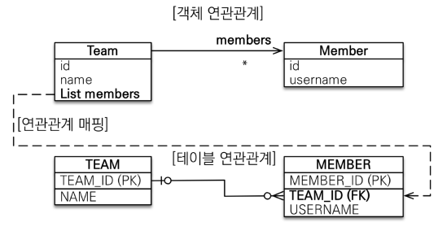

# 다양한 연관관계 매핑
## <u>다</u>대일 (N:1)
- '다' 쪽이 연관관계의 주인
- 외래키가 있는 쪽이 연관관계의 주인
- 
```java
[Member.java] - 연관관계의 주인
@ManyToOne  
@JoinColumn(name = "TEAM_ID")  
private Team team;

------------------------------------
[Team.java]
@OneToMany(mappedBy = "team")  
private List<Member> members = new ArrayList<>();

```


---
## <u>일</u>대다 (1:N) 
- '일' 쪽이 연관관계의 주인

- Team만 Member정보가 필요함
- 테이블의 외래키는 똑같이 Member테이블에 있지만 Team의 members가 연관관계의 주인
- 반대편 테이블의 외래 키를 관리하 는 특이한 구조
```java
[Team.java] - 연관관계의 주인
@OneToMany  
@JoinColumn(name = "TEAM_ID")  
private List<Member> members = new ArrayList<>();

------------------------------------
Member member = new Member();  
member.setName("member1");  
  
em.persist(member);  
  
Team team = new Team();  
team.setName("teamA");  

team.getMembers().add(member);  //MEMBER 테이블의 TEAM_ID UPDATE
  
em.persist(team);  
  
tx.commit();

```

``` text
Hibernate: 
    /* insert hellojpa.Member
        */ insert 
        into
            Member
            (USERNAME, MEMBER_ID) 
        values
            (?, ?)
Hibernate: 
    /* insert hellojpa.Team
        */ insert 
        into
            Team
            (name, TEAM_ID) 
        values
            (?, ?)
Hibernate: 
    /* create one-to-many row hellojpa.Team.members */ update
        Member 
    set
        TEAM_ID=? 
    where
        MEMBER_ID=?

```
---
## 일대일 (1:1) 
- ``

---
## 다대다 (N:M)