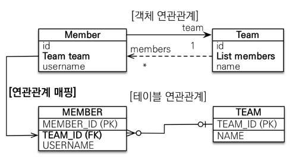
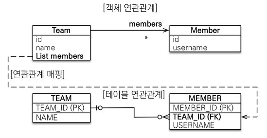

# 다양한 연관관계 매핑
## <u>다</u>대일 (N:1)
- '다' 쪽이 연관관계의 주인
- 외래키가 있는 쪽이 연관관계의 주인
- 
```java
[Member.java] - 연관관계의 주인
@ManyToOne  
@JoinColumn(name = "TEAM_ID")  
private Team team;

------------------------------------
[Team.java]
@OneToMany(mappedBy = "team")  
private List<Member> members = new ArrayList<>();

```


---
## <u>일</u>대다 (1:N) - 비추
- '일' 쪽이 연관관계의 주인

- Team만 Member정보가 필요함
- 테이블의 외래키는 똑같이 Member테이블에 있지만 Team의 members가 연관관계의 주인
- 반대편 테이블의 외래 키를 관리하 는 특이한 구조
- 연관관계 관리를 위해 추가로 UPDATE SQL 실행
- 일대다 양방향을 사용하려면 다대일 양방향을 사용하자
```java
[Team.java] - 연관관계의 주인
@OneToMany  
@JoinColumn(name = "TEAM_ID")  
private List<Member> members = new ArrayList<>();

------------------------------------
Member member = new Member();  
member.setName("member1");  
  
em.persist(member);  
  
Team team = new Team();  
team.setName("teamA");  

team.getMembers().add(member);  //MEMBER 테이블의 TEAM_ID UPDATE
  
em.persist(team);  
  
tx.commit();

```

``` text
Hibernate: 
    /* insert hellojpa.Member
        */ insert 
        into
            Member
            (USERNAME, MEMBER_ID) 
        values
            (?, ?)
Hibernate: 
    /* insert hellojpa.Team
        */ insert 
        into
            Team
            (name, TEAM_ID) 
        values
            (?, ?)
Hibernate: 
    /* create one-to-many row hellojpa.Team.members */ update
        Member 
    set
        TEAM_ID=? 
    where
        MEMBER_ID=?

```
---
## 일대일 (1:1) 
- 외래키가 있는 곳이 연관관계의 주인
	- MEMBER 조회 시
	- 주테이블에 외래키가 있는 경우 : MEMBER(LOCKER_ID) - LOCKER
	- 대상테이블에 외래키가 있는 경우 : MEMBER - LOCKER(MEMBER_ID)

- 연관관계의 주인이 호출할 때는 지연 로딩이 정상적으로 동작하지만, 
- ** <u>★연관관계의 주인이 아닌 곳에서 호출한다면 프록시 기능의 한계로 지연 로딩이 아닌 즉시 로딩으로 동작</u> **
	- Member 조회 시 Locker locker 의 프록시 객체를 생성 하려면 LOCKER 테이블에서 MEMBER_ID로 조회결과가 있는지 확인이 필요 (즉시 로딩)
- 프록시 객체는 ID 값만 가지고 있고 내부는 비어있는 가짜 객체이다.
	- 실제 엔티티가 없을 경우 프록시 객체를 생성 할 수 없다.

---
## 다대다 (N:M)
- `@ManyToMany` / `@JoinTable`
- 매핑정보만 들어가고 다른 데이터를 추가할 수 없음.
- `@ManyToMany` -> `@OneToMany` + `@ManyToOne`
