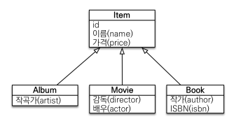
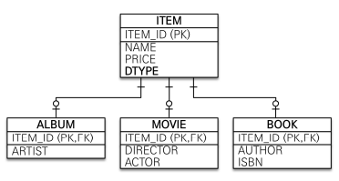
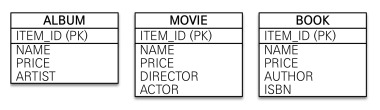

# 고급 매핑
## 상속관계 매핑
- 객체의 상속 구조와 DB의 슈퍼타입 서브타입 관계를 매핑

- `@Inheritance(strategy=InheritanceType.XXX)`
	- JOINED : 조인 전략 
	- SINGLE_TABLE : 단일 테이블 전략 (기본)
	- TABLE_PER_CLASS : 구현 클래스마다 테이블 전략
- `@DiscriminatorColumn(name="DTYPE")`
	- 상속객체 구분되는 값 저장되는 컬럼의 이름
- `@DiscriminatorValue("XXX")`
	- 상속 객체 구분되는 값 재설정 (기본 : 엔티티명)

### 조인 전략

- 각각 테이블로 변환
- INSERT 2번
- JOIN하여 불러옴

### 단일 테이블 전략
![[../images/image_20230924215429.png]]
- 통합 테이블로 변환
- `@DiscriminatorColumn(name="DTYPE")` 필수로 자동 생성

### 구현 클래스마다 테이블 전략

- 서브타입 테이블로 변환
- 

---
## @MappedSuperclass