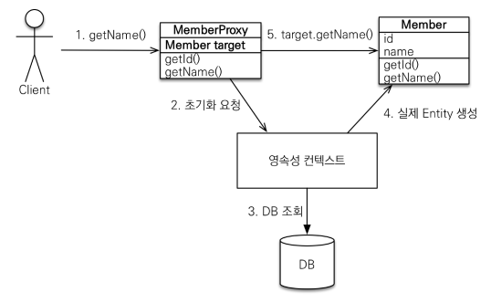

# 프록시와 연관관계 관리
## 프록시
- Member 조회 시 Team 데이터도 같이 가져와야 할까?
	- Team 데이터가 필요하다면 Member 조회 시 가져오는게 이득이지만
	- Team 데이터가 필요없다면 Member 데이터만 조회해 오는게 이득이다.
- `em.find()`
	- 데이터베이스를 통해서 실제 엔티티 객체 조회
- `em.getReference()`
	- 데이터베이스 조회를 미루는 프록시(가짜) 엔티티 객체 조회
	- `class hellojpa.Member$HibernateProxy$xCepckbg`
```java
Member findMember = em.getReference(Member.class, member.getId()); 

System.out.println("findMember.getId() = " + findMember.getId());  //SELECT 호출
System.out.println("findMember.getName() = " + findMember.getName());
```

- 실제 객체의 참조(target)을 보관
- 실제 클래스를 상속 받아서 만들어짐
- 실제 클래스와 겉 모양이 같다.


1. getName() 호출 시 target에 값이 있는지 확인
2. target이 비어있으니 실제 객체를 영속성 컨텍스트에 초기화 요청
3. DB를 조회
4. 실제 Entity를 생성
5. target에 4번의 생성한 실제 Entity를 연결

- 프록시 인스턴스의 초기화 여부 확인
	- PersistenceUnitUtil.isLoaded(Object entity)
- 프록시 클래스 확인 방법
	- entity.getClass().getName() 출력(..javasist.. or HibernateProxy…)
- 프록시 강제 초기화
	- org.hibernate.Hibernate.initialize(entity);

## 프록시의 특징
- 프록시 객체는 처음 사용할 때 한 번만 초기화
- 프록시 객체를 초기화 할 때, 프록시 객체가 실제 엔티티로 바뀌는 것은 아님, 초기화되면 프록시 객체를 통해서 실제 엔티티에 접근 가능
```java
Member m1 = em.getReference(Member.class, member1.getId());

System.out.println("m1 = " + m1.getClass());  //Member$HibernateProxy$EXkoOb05
System.out.println("m1.getName() = " + m1.getName());  //SELECT
System.out.println("m1 = " + m1.getClass());  //Member$HibernateProxy$EXkoOb05
```

- instance of / 프록시 객체는 원본 엔티티를 상속받음, 따라서 타입 체크시 주의해야함 (== 비교 실패) 
```java
Member m1 = em.find(Member.class, member1.getId());  
Member m2 = em.getReference(Member.class, member2.getId());  
  
System.out.println(m1 instanceof Member);  
System.out.println(m2 instanceof Member);
```
- 영속성 컨텍스트에 찾는 엔티티가 이미 있으면 em.getReference()를 호출해 도 실제 엔티티 반환
```java
Member m1 = em.find(Member.class, member1.getId());  
System.out.println("m1.getClass() = " + m1.getClass());  //hellojpa.Member
  
Member reference = em.getReference(Member.class, member1.getId());  
System.out.println("reference.getClass() = " + reference.getClass());  //hellojpa.Member

System.out.println("a == a: " + (m1 == reference));
```

```java
Member m1 = em.getReference(Member.class, member1.getId());  
System.out.println("m1 = " + m1.getClass());  //Member$HibernateProxy$EXkoOb05
  
Member reference = em.getReference(Member.class, member1.getId());  
System.out.println("reference = " + reference.getClass());  //Member$HibernateProxy$EXkoOb05

System.out.println("a == a: " + (m1 == reference));

===============================================================
Member ref = em.getReference(Member.class, member1.getId());  
System.out.println("ref = " + ref.getClass());  //Member$HibernateProxy$EXkoOb05  

Member find = em.find(Member.class, member1.getId());  
System.out.println("find = " + find.getClass());  //Member$HibernateProxy$EXkoOb05 

System.out.println("a == a: " + (ref == find));

```

- 영속성 컨텍스트의 도움을 받을 수 없는 준영속 상태일 때, 프록시를 초기화하면 문제 발생 (하이버네이트는 org.hibernate.LazyInitializationException 예외를 터트림
	- clear, detach, close

---
## 즉시 로딩과 지연 로딩
- 단순히 member 정보만 사용하는 비즈니스 로직
- `fetch = FetchType.LAZY`
- 실제 team을 사용하는 시점에 초기화(DB 조회)

- Member와 Team을 자주 함께 사용
- `fetch = FetchType.EAGER`
- 